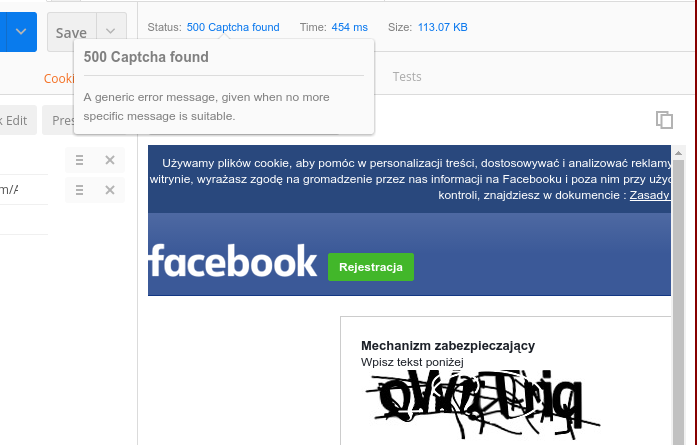

Fixtures
========

Fixtures are providing a possibility to edit a response that goes to the end user (eg. to your crawler).
There are many cases when this is helpful for example a multiple instance of webproxy for crawling behind a load balancer.
A load balancer could be configured to use `ip_hash` strategy so, always keep awake only one webproxy in the cloud, unless it will be
not usable. In this case we can tell the load balancer, that for example a captcha was found, so the webproxy for the moment is not usable anymore, let's switch to other node.



#### Enabling fixtures

Example of enabling a fixture using an environment variable:
```
export WW_TOKEN="FacebookCaptchaTo500,SomethingElse" 
```

Example using config:
```
return [
    'fixtures' => 'FacebookCaptchaTo500',
];
```

#### Custom fixtures

1. Should be available for the composer autoload, so a `custom-fixtures` or vendor is a good place.
Easiest way is to create a fixture in `custom-fixtures` directory with a `Wolnosciowiec\CustomFixtures\` namespace.

2. Every fixture should implement `Wolnosciowiec\WebProxy\Fixtures\FixtureInterface`.
3. A registration is necessary through configuration variable or environment variable

Example (environment variable):
```
export WW_FIXTURES="MyFixture,NotFoundTo500"
export WW_FIXTURES_MAPPING='{"MyFixture": "\\Wolnosciowiec\\CustomFixtures\\MyFixture"}'
```

Example (configuration file):
```
<?php

return [
    'fixtures' => 'MyFixture',
    'fixtures_mapping' => '{"MyFixture": "\\Wolnosciowiec\\CustomFixtures\\MyFixture"}',
];
```
